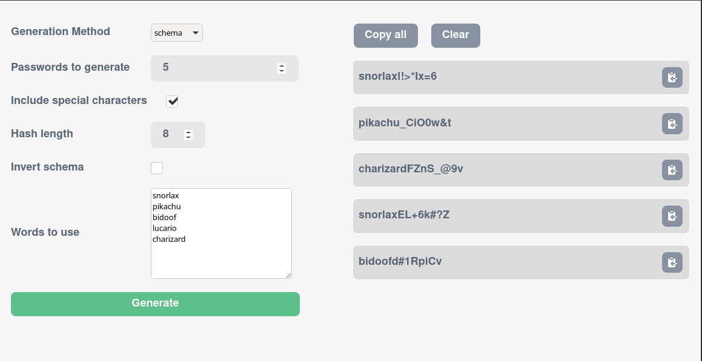
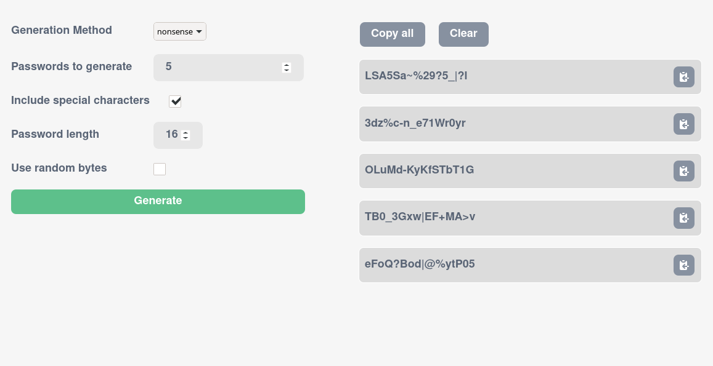

# Passwordo (provisional name)

## Made with Rust and Typescript

Generate good-enough passwords

Features:
- Passwords from random ascii characters
- Passwords from a list of words + random ascii characters
- Use random bytes (printed as hexadecimal) for your passwords

